--- 
# Лабораторные работы по Python

Добро пожаловать в будущее 🚀  
Сборник лабораторных работ по курсу **Python** — от базовых операций до работы с файлами и конвертацией форматов.

---

## ЛР1 — Введение в Python (ввод, строки и арифметика
## 🔹Задание - 1
```python
name = input('Enter your name: ')
age = int(input('Enter your age: '))
print(f'Hello, {name}! In a year, you will be {age + 1}.')

```


---
## 🔹Задание - 2
```python
a = input()
b = input()
a = float(a.replace(',', '.'))
b = float(b.replace(',', '.'))
avg = round((a + b)/ 2, 2)
sumi = a + b
print(sumi, avg, sep='; ')
```
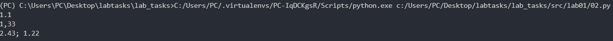
---
## 🔹Задание - 3
```python
p = int(input())  # preço
d = int(input())  # desconto %
n = int(input())  # imposto %

b = p * (1 - d/100)
tax = b * n / 100
total = b + tax

print(f'Base: {round(b, 2)} ₽')
print(f'Imposto: {round(tax, 2)} ₽')
print(f'Total: {round(total, 2)} ₽')
```

---
## 🔹Задание - 4
``` python
t = int(input())
print(f'{t//60}:{t%60:02d}')
```
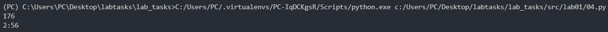
--- 
## 🔹Задание - 5
```python
s = input().strip()
init = ''.join([x[0] for x in s.split()])
print(init)
print(len(s.replace(' ', '')) + 2)
```
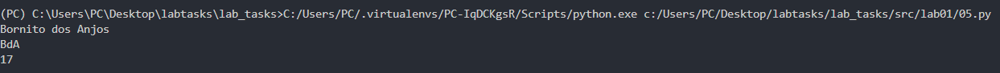
--- 
## 🔹Задание - 6
```python
n = int(input())
pres, dist = 0, 0

for _ in range(n):
    *_, mode = input().split()
    if mode == 'True':
        pres += 1
    else:
        dist += 1

print(pres, dist)
```
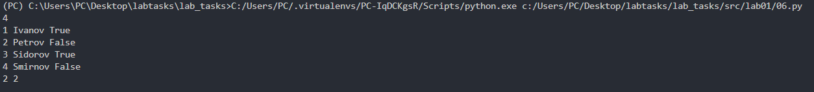
--- 
## 🔹Задание - 7
```python
s = input()
for i, c in enumerate(s):
    if c.isupper():
        start = i
        break
for j in range(start, len(s)):
    if s[j].isdigit():
        step = j - start + 1
        break
print(s[start::step])
```
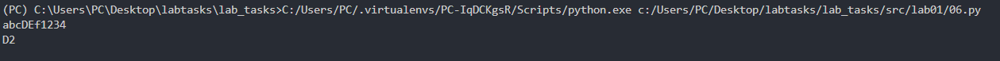
--- 
## 🔹 **Lab 2 — A**
```python
def min_max(lst):
    if not lst: raise ValueError("Empty list")
    return min(lst), max(lst)

def uniq_sorted(lst):
    return sorted(set(lst))

def flat(matrix):
    out = []
    for row in matrix:
        if not isinstance(row, (list, tuple)):
            raise TypeError('Invalid row type')
        out += row
    return out

print(min_max([-3.1, 2]))
print(uniq_sorted([1.0, 1, 2.5, 2.5, 0]))
print(flat([[1], [], [2, 3]]))
```
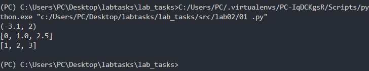
--- 
## 🔹 **Lab 2 — B**
```python
def transpose(m):
    if not m: return []
    if any(len(row) != len(m[0]) for row in m): raise ValueError("Jagged")
    return [list(x) for x in zip(*m)]

def row_sum(m):
    return [sum(r) for r in m]

def col_sum(m):
    if not m: return []
    if any(len(r) != len(m[0]) for r in m): raise ValueError("Jagged")
    return [sum(r[i] for r in m) for i in range(len(m[0]))]

print(transpose([[1,2],[3,4]]))
print(row_sum([[1,2,3],[4,5,6]]))
print(col_sum([[-1,1],[10,-10]]))
```
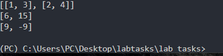
--- 
## 🔹 **Lab 2 — C**
```python
def name_to_initials(name):
    parts = name.strip().split()
    return parts[0].capitalize() + ' ' + ''.join([p[0].upper()+'.' for p in parts[1:]])

def format_student(data):
    name, grp, gpa = data
    if not name.strip(): raise ValueError('Name empty')
    if not grp.strip(): raise ValueError('Group empty')
    if not isinstance(gpa, float): raise TypeError('GPA type')

    print(f'{name_to_initials(name)}, group {grp}, GPA {gpa:.2f}')

format_student(("  petrova   anna  ivanovna ", "XYZ-01", 4.0))
```
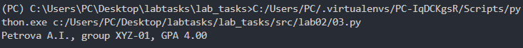
--- 
## 🔹 **Lab 3 — A**
```python
import string

def clean(text, lower=True, replace_yo=True):
    if lower: text = text.lower()
    if replace_yo: text = text.replace('ё','е').replace('Ё','Е')
    return ' '.join(text.replace('\n', ' ').replace('\t', ' ').split())

def split_words(txt):
    valid = 'абвгдеёжзийклмнопрстуфхцчшщъыьэюя' + string.ascii_lowercase + string.digits
    return ' '.join([c if c in valid else ' ' for c in txt]).split()

def word_freq(tokens):
    return {w: tokens.count(w) for w in set(tokens)}

def top_words(freq, n=5):
    return sorted(freq.items(), key=lambda x: (-x[1], x[0]))[:n]

# Teste
print(clean("  exemplo  de   texto "))
print(split_words("texto 😀 emoji"))
print(word_freq(["a", "b", "a"]))
print(top_words({'a': 2, 'b': 1}))
```
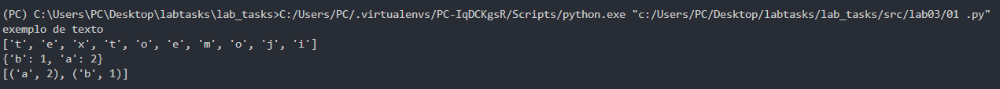
--- 
## 🔹 **Lab 3 — B**
```python
from text import clean, split_words, word_freq, top_words

def main():
    txt = input()
    words = split_words(clean(txt))
    total = len(words)
    unique = len(set(words))
    freq = word_freq(words)
    top = top_words(freq)

    print(f'Total words: {total}')
    print(f'Unique words: {unique}')
    print('\nTop 5:')
    print(f'{"Word":^12} | {"Count":^6}')
    print('-' * 21)
    for w, c in top:
        print(f'{w:^12} | {c:^6}')

main()
```
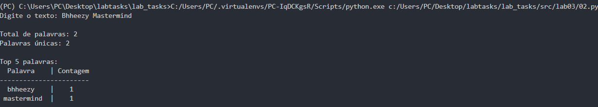
--- 
## 🔹 **Lab 4 — A**

## **[io_txt_csv.py](src/lab04/io_txt_csv.py)**
--- 
## 🔹 **Lab 4 — B**
## **[text_report.py](src/lab04/text_report.py)** 

## Output

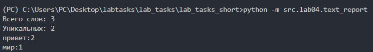

# ЛР5 — JSON и конвертации (JSON↔CSV, CSV→XLSX)

## Быстрый старт
```bash
# активация виртуалки и установка зависимостей
python -m venv .venv && . .venv/bin/activate  # Windows: .venv\Scripts\activate
pip install -r requirements.txt

# Конверсии (запускайте из корня python_labs/)
python - <<'PY'
from src.lab05.json_csv import json_to_csv, csv_to_json
from src.lab05.csv_xlsx import csv_to_xlsx
json_to_csv('data/samples/people.json', 'data/out/people_from_json.csv')
csv_to_json('data/samples/people.csv', 'data/out/people_from_csv.json')
csv_to_xlsx('data/samples/people.csv', 'data/out/people.xlsx')
print('Готово')
PY
```

## Допущения
- Кодировка строго UTF-8.
- Для JSON→CSV заголовки формируются как **алфавитно отсортированное объединение всех ключей**.
- Для CSV→JSON первая строка — обязательный заголовок; значения сохраняются **как строки**.
- XLSX создаётся лист **Sheet1**, автоширина ≥ 8 символов.

## Проверка сценариев
- JSON→CSV: сравните число строк (N объектов → N строк CSV + 1 заголовок).
- CSV→JSON: сравните множество ключей и количество объектов.
- CSV→XLSX: откройте файл `data/out/people.xlsx` в Excel/LibreOffice и проверьте ширины колонок.

## Структура
См. дерево репозитория в условии. В этой сборке созданы минимальные примеры и артефакты.

